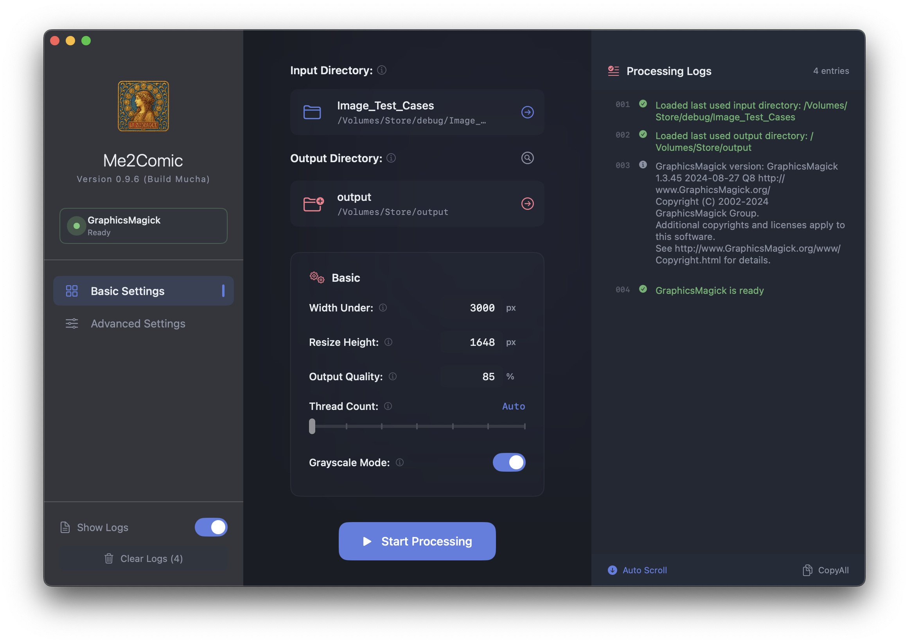
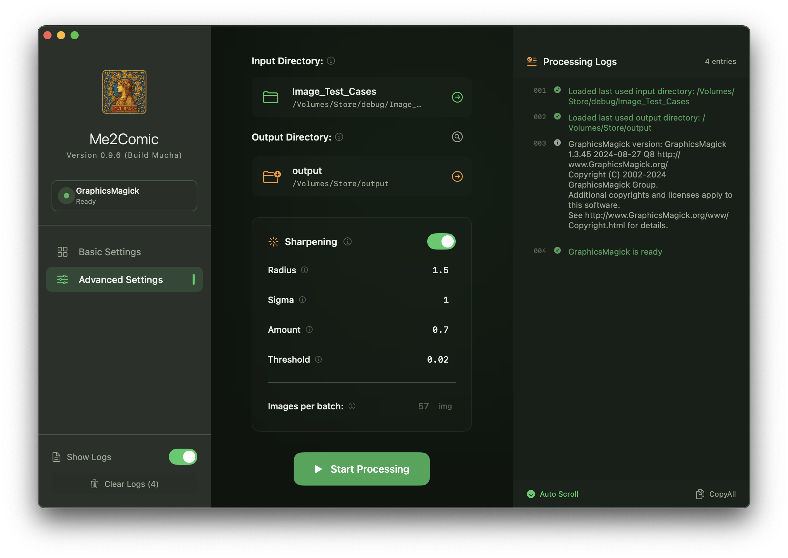
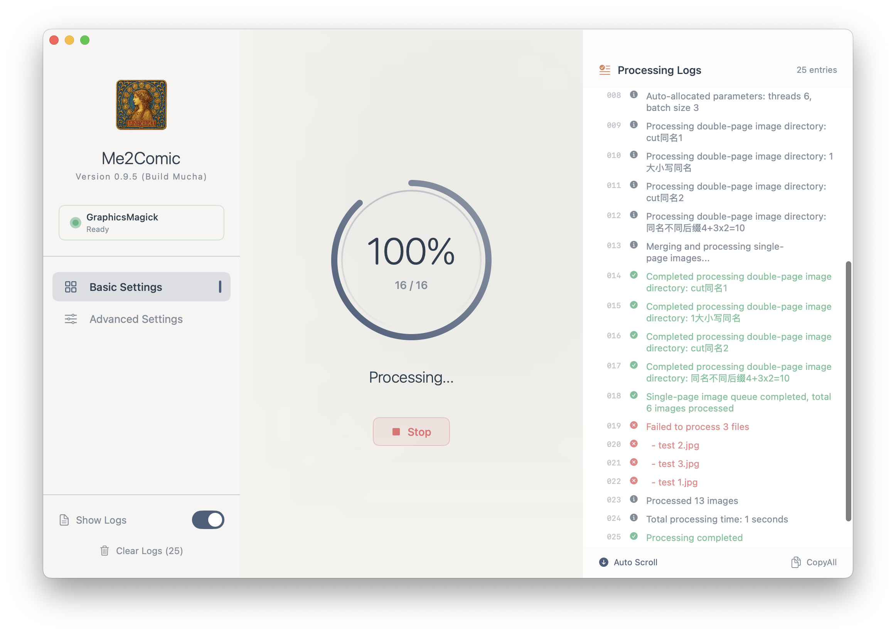

# Me2Comic

[](https://github.com/DawnLiExplorer/Me2Comic/actions/workflows/ci.yml)
[](#)
[](https://opensource.org/licenses/MIT)

[English](README.md) | [中文](docs/README_zh.md) | [日本語](docs/README_ja.md)

Me2Comic is a macOS GUI tool that calls GraphicsMagick to batch convert and crop images, prioritizing quality while reducing file size. It started as a weekend side project for processing comic images and experimenting with Swift. Now it's open-sourced under the MIT license—feel free to explore, tweak it, or just take a look. 🍻

<div style="display: flex; justify-content: space-between; gap: 20px;">
  
  
  
</div>

## Features

• Batch convert JPG/JPEG/PNG → JPG  
• Auto-split oversize images (right priority)   
• Parameter controls  
• Multi-threading  
• Task logs  

## Localization

• 简体中文 | 繁體中文 | English | 日本語 

## Requirements

- macOS 14.0+
- Swift 6
- GraphicsMagick:

```shell
  brew install graphicsmagick
```

## Directory Structure Diagram

Two input modes are supported:

### Mode A — Directory containing image subfolders (original behavior)

Each first-level subdirectory is processed as an independent batch.

**Input**
<pre>
/Volumes/Comics/ToProcess/
├── CITY HUNTER Vol.xx/
│   ├── page001.jpg
│   └── page002.jpg ...
├── One Piece Vol.xx/
│   └── ...
└── Comic 3/
    └── ...
</pre>

### Mode B — Directory containing images directly (single-batch mode)

If the selected directory itself contains image files, all images are processed as one batch. Any subdirectories are ignored.

**Input**
<pre>
/Volumes/Comics/CITY HUNTER Vol.xx/
├── page001.jpg
├── page002.jpg
└── page003.jpg ...
</pre>

### **Output**
<pre>
/Volumes/Comics/Done/
├── CITY HUNTER Vol.xx/
│   ├── CITY.HUNTER.CE.1-1.jpg  (Split if oversized, right half named first)
│   ├── CITY.HUNTER.CE.1-2.jpg  (Left half)
│   └── CITY.HUNTER.CE.2.jpg    (Converted directly if not oversized)
├── One Piece Vol.xx/
│   └── ...
└── Comic 3/
    └── ...
</pre>

Processed images are packed into MOBI comic files using [Me2Press](https://github.com/DawnLiExp/Me2Press).


## Build & Release:

Gather the seven Dragon Balls ➔ [Actions](../../actions) ➔ `🐉 SHENRON! Grant my wish! ✨` ➔ Summon the Eternal Dragon `Run workflow`  
<sub>*(Note: Wait time depends on Shenron's cosmic mood 🌌✨)*</sub>

### <sub>※ *Note* </sub> 
<sub>※ *App icon adapted from Mucha's Zodiac, build names honor his legacy. No official affiliation.* </sub>

